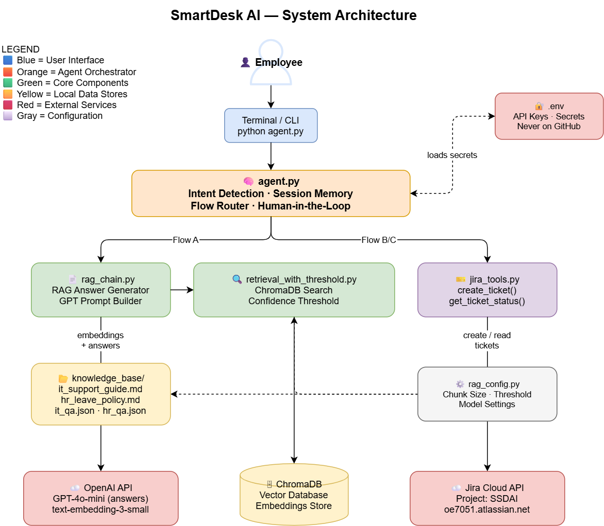

# SmartDesk AI — Architecture Documentation

## System Architecture Diagram



## Component Descriptions

### Layer 1 — User Interface
| Component | Description |
|---|---|
| Terminal CLI | Employee interacts via `python agent.py` |
| Input handler | Validates and cleans all employee messages |

### Layer 2 — Agent Orchestrator
| Component | Description |
|---|---|
| `agent.py` | Main orchestrator — routes all conversation flows |
| Intent Detection | Classifies messages as KB_QUERY or CHECK_STATUS |
| Session Memory | Remembers employee email across conversation turns |
| Human-in-the-Loop | Confirms before creating any Jira ticket |

### Layer 3 — Core Components
| Component | Description |
|---|---|
| `rag_chain.py` | Builds GPT prompts from retrieved context |
| `retrieval_with_threshold.py` | Searches ChromaDB with confidence gating |
| `jira_tools.py` | Creates and reads Jira tickets via REST API |

### Layer 4 — Local Data Stores
| Component | Description |
|---|---|
| `ChromaDB` | Vector database storing all document embeddings |
| `knowledge_base/` | Source documents — markdown and JSON files |
| `rag_config.py` | Central configuration for all RAG settings |

### Layer 5 — External Services
| Component | Description |
|---|---|
| OpenAI API | GPT-4o-mini for answer generation |
| OpenAI Embeddings | text-embedding-3-small for vector creation |
| Jira Cloud API | REST API for ticket CRUD operations |

## Data Flow

### Flow A — Knowledge Base Answer

Employee message
→ agent.py detects KB_QUERY intent
→ rag_chain.py calls retrieve_with_threshold()
→ retrieval_with_threshold.py searches ChromaDB
→ Top 3 chunks returned if above threshold
→ rag_chain.py builds GPT prompt with context
→ OpenAI API generates grounded answer
→ Answer returned to employee

### Flow B — Ticket Creation
Employee message → RAG returns ANSWER_NOT_FOUND
→ agent.py asks for employee email
→ agent.py shows ticket summary
→ Employee confirms yes
→ jira_tools.py calls Jira Cloud API
→ New ticket created in SSDAI project
→ Ticket ID returned to employee

### Flow C — Ticket Status
Employee asks about ticket status
→ agent.py detects CHECK_STATUS intent
→ agent.py asks for employee email
→ jira_tools.py searches Jira by email
→ Matching tickets returned and formatted
→ Ticket list displayed to employee

## Security Architecture

| Security Measure | Implementation |
|---|---|
| API key storage | `.env` file — never committed to GitHub |
| .gitignore | Blocks `.env`, `venv/`, `chroma_db/` |
| No hardcoded secrets | Verified by `test_security.py` |
| Human confirmation | Required before any write operation |

# SmartDesk AI — Architecture

## System Overview

SmartDesk AI is a conversational support agent for Roadmap Consulting.
It routes employee questions through three flows depending on intent:

- **Flow A** — Answer from the knowledge base using RAG
- **Flow B** — Create a Jira support ticket when no answer is found
- **Flow C** — Retrieve open Jira tickets for an employee by email

---

## Chunking Strategy

Documents are split into overlapping text chunks before being embedded
and stored in ChromaDB. The settings live in `src/rag/rag_config.py`.

| Setting | Value | Reason |
|---|---|---|
| `CHUNK_SIZE` | 800 characters | Fits typical policy paragraphs and Q&A pairs within a single embedding without truncation |
| `CHUNK_OVERLAP` | 150 characters | Preserves sentence continuity across chunk boundaries so answers that span two paragraphs are not split mid-sentence |
| `TOP_K_RESULTS` | 3 chunks | Returns enough context for multi-step answers without exceeding the LLM context window |
| `CONFIDENCE_THRESHOLD` | 0.15 | Filters low-relevance matches; anything below this score escalates to ticket creation |

**Why 800 characters?**
The knowledge base consists mainly of HR policy paragraphs and IT troubleshooting
steps. At 800 characters each chunk holds one complete policy clause or one
numbered procedure — the smallest meaningful unit a support answer needs.
Smaller chunks (e.g. 300) fragment these units; larger chunks (e.g. 1500)
dilute the embedding signal with unrelated content.

**Why 150-character overlap?**
Policy documents frequently carry context from one paragraph into the next
(e.g. "As mentioned above, employees must…"). A 150-character overlap ensures
the opening words of each chunk echo the closing words of the previous one,
preventing retrieval misses at paragraph boundaries.

**Splitter used:** `RecursiveCharacterTextSplitter` from LangChain, which
tries to split on `\n\n`, then `\n`, then ` ` before falling back to
character-level splitting. This respects natural document structure.

---

## RAG Pipeline

```
src/data/index_knowledge_base.py   (run once to build the index)
         │
         ├── Load markdown docs   → it_support_guide.md, hr_leave_policy.md
         ├── Load JSON Q&A pairs  → it_qa.json, hr_qa.json
         └── Load JSONL dataset   → hr-policies-qa-dataset.jsonl
                  │
                  ▼
         RecursiveCharacterTextSplitter
         (CHUNK_SIZE=800, CHUNK_OVERLAP=150)
                  │
                  ▼
         OpenAI text-embedding-3-small
                  │
                  ▼
         ChromaDB  →  chroma_db/  (local disk)


src/rag/retrieval_with_threshold.py   (called at query time)
         │
         ├── Embed user query via text-embedding-3-small
         ├── Similarity search in ChromaDB  (TOP_K_RESULTS=3)
         └── Filter by CONFIDENCE_THRESHOLD=0.15
                  │
                  ├── Score ≥ 0.15 → pass chunks to rag_chain.py
                  └── Score < 0.15 → return RESULT_NOT_FOUND → Flow B


src/rag/rag_chain.py   (generates the final answer)
         │
         ├── Build prompt: SYSTEM_PROMPT + retrieved context
         ├── Call OpenAI GPT-4o-mini
         └── Return grounded answer with source attribution
```

---

## Agent Routing

```
Employee Input
      │
      ▼
src/agents/agent.py  — detect_intent()
      │
      ├── KB_QUERY      → src/workflow/flow_a.py  (RAG lookup)
      │                        │
      │                        └── NOT_FOUND → src/workflow/flow_b.py
      │
      ├── CHECK_STATUS  → src/workflow/flow_c.py  (Jira read)
      │
      └── UNCLEAR       → Ask employee to rephrase
```

---

## External Dependencies

| Service | Purpose | Client |
|---|---|---|
| OpenAI API | Embeddings + LLM answers | `openai` + `langchain-openai` |
| Jira Cloud REST API | Ticket creation and status reads | `jira` (Python library) |
| ChromaDB | Local vector store | `chromadb` + `langchain-chroma` |

All credentials are loaded from `.env` at runtime via `python-dotenv`.
No secrets are hardcoded in source files.
